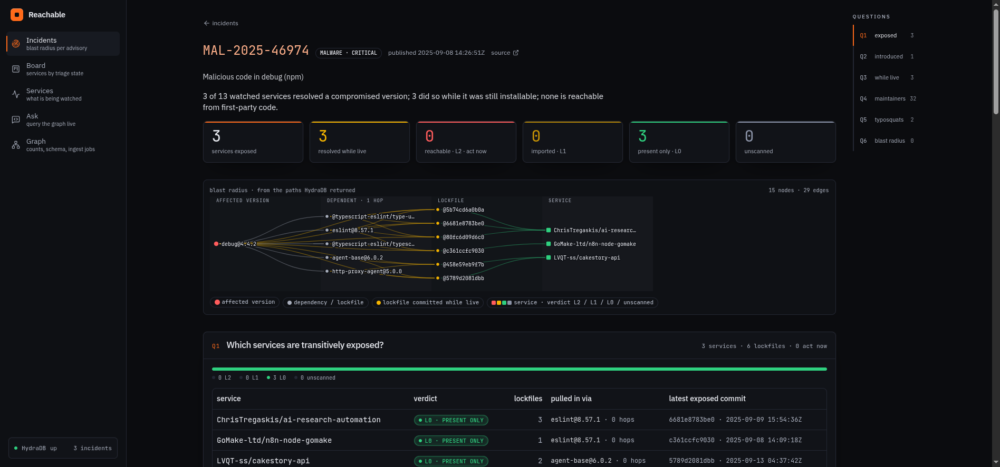
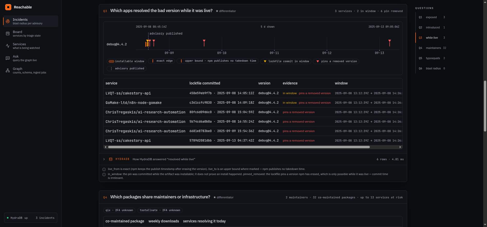

# Reachable

**Live console:** <https://reachable-lac.vercel.app> · report: <https://reachable-lac.vercel.app/incident/MAL-2025-46974> · guide: <https://reachable-lac.vercel.app/docs/why>

**Supply-chain incident response on a graph.** When an npm package is compromised,
answer in milliseconds — from HydraDB, not from Python — which services are transitively
exposed, which resolved the bad version *while it was still installable*, which packages
share the same maintainers, which nearby names are look-alikes, and which exposures are
actually reachable from first-party code.



```
MAL-2025-46974 · debug@4.4.2 · 2025-09-08
3 of 13 watched services resolved a compromised version · 3 did so while it was live
· 0 reachable from first-party code · who-is-exposed: 7 ms warm / 888 ms cold
```

Built on the open-source **[HydraDB](https://github.com/hydra-db/hydradb)** engine
(`graph-node`, OpenCypher over Bolt, `algo.MSpaths` / `algo.SPpaths`). No LLM anywhere:
questions are a typed grammar that compiles to verified Cypher, and every panel shows the
statement that produced it.

---

## The problem

On 2025-09-08 an npm maintainer was phished and 18 packages with over two billion combined
weekly downloads (`chalk`, `debug`, `ansi-styles`, …) shipped a crypto-clipper. The malicious versions were
installable for about 95 minutes. Every team asked the same six questions and most answered
them with grep over lockfiles and a spreadsheet:

1. Which of our services are **transitively** exposed?
2. Which version introduced it?
3. Which apps resolved the bad version **while it was live** — not "do we depend on `debug`",
   but "did a lockfile pin `4.4.2` between 13:12 and 14:26 UTC"?
4. What else do the same maintainers publish (the next blast radius)?
5. Are there typosquats parked next to the package?
6. What is the complete blast radius — and which part of it needs action *now*?

Each is a traversal over a graph that changes with every commit. Reachable makes that graph
real and lets HydraDB do the walking.

## What it is

- **A worker** (`worker/`, Python 3.14, `neo4j` driver over Bolt) that ingests watched GitHub
  repositories — every lockfile commit (`package-lock.json` v2/v3 or `pnpm-lock.yaml` v6/v9;
  yarn is not supported yet) becomes a time-stamped `Lockfile` node whose `RESOLVED` edges are
  the flattened install tree the package manager wrote — plus npm versions, publish and
  removal times, maintainers, OSV advisories with an **installable window on the `AFFECTS`
  edge**, first-party import scans, and a materialised near-name graph.
- **A console** (`web/`, Next 16) — a landing page at `/`, then `/incidents` and the incident
  report that answers the six questions with the executed Cypher on every card, a triage
  **Board**, a **Services** registry with add-by-URL ingest jobs, an **Ask** page (typed
  questions → Cypher, live), a **Graph** page with a live force-directed neighbourhood
  explorer, and in-app **Docs** (`/docs`, rendered from `docs/console/*.md` and
  `docs/schema.md`). Design: dark operations console, one accent, semantic verdict colours,
  every number server-rendered true and never estimated; live pages degrade to designed
  states, API errors surface as toasts, unknown routes get a designed 404.
- **An MCP server** (`worker/reachable/mcp_server.py`) exposing twelve tools so Claude Code,
  Codex, OpenCode, Cursor or Copilot can ask the graph the same questions — every graph answer
  carrying the statement that produced it, and the one tool that writes annotated as such.
  `scripts/mcp_smoke.py` drives all eleven read-only tools against a running worker.
- **A badge** (`/badge/{owner}/{repo}.svg`) for READMEs, and **Export PDF** on every report
  (`?print=1` expands every statement; the browser's print dialog saves the page as PDF — see
  `docs/console/using.md`).

## The six questions → how HydraDB answers them

| # | Question | In-engine mechanism (the executed statement is on the card) | Measured, `MAL-2025-46974`, 13 services / 246 lockfiles |
|---|---|---|---|
| 1 | Transitively exposed | `(bad:Version)<-[:RESOLVED]-(l:Lockfile)<-[:HAS_LOCKFILE]-(s:Service)` — RESOLVED is the flattened tree, so membership is exact in one hop; `algo.SPpaths` (`incoming`, `pathCount 3`) returns the *proving chain* per lockfile; `algo.MSpaths` takes N affected versions × M services in one call | who-is-exposed **888 ms cold / 7.06 ms warm p50** (5 runs); MSpaths 699 ms cold / 0.72 ms warm |
| 2 | Version introduced | `-[:AFFECTS]->(v) … ORDER BY v.published_at ASC LIMIT 1` (engine has no `min()`); `Version.removed` from the registry's time-map orphan rule | 9.05 ms |
| 3 | Resolved **while live** ★ | one predicate over two *relationship* properties: `WHERE r.at >= af.live_from AND r.at <= af.live_to`; second evidence class `v.removed = true` (pinning an erased version is only possible while it was live) | 4.81 ms · 6 rows · 2 in-window commits (14:05Z, 14:09Z) after a 13:12Z publish |
| 4 | Shared maintainers ★ | `(bad)-[:VERSION_OF]->(:Package)<-[:MAINTAINS]-(m)-[:MAINTAINS]->(other)` then per package `<-[:RESOLVED]-(l)<-[:HAS_LOCKFILE]-(s)` grouped by service | 13.6 s (32 co-maintained packages; exposure computed for the 8 most downloaded — a stated cap, the rest render as "not computed") |
| 5 | Typosquats ★ | `NAME_SIMILAR_TO` materialised at ingest (Damerau-Levenshtein ≤ 1, scope/hyphen/homoglyph/affix kinds) so proximity is a traversal, not a scan | 2.6 ms |
| 6 | Complete blast radius | all of the above composed by `worker/reachable/incident.py` into one JSON with per-query ms and cold/warm | 16.45 s total including Q4 |
| + | Which need action | `File`/`CONTAINS`/`IMPORTS` from an import scan at the exact exposed commit → L0 (present only) / L1 (imported) / **unscanned** (never called safe) | 4.7–13.3 ms per service |

Numbers are wall-clock from the Python driver over loopback Bolt, recorded in
[`benchmarks/results/`](benchmarks/results/) with the HydraDB image digest. Cold = first run
after the node was idle (object-store page-in), warm = subsequent runs; both are reported and
neither is estimated. `worker/out/<id>.json` is the exact payload the console renders.



## What breaks without a graph database

- **Q3 is a bitemporal join per affected version in SQL**; here it is one `WHERE` comparing
  two edge properties, because the installable window lives on the `AFFECTS` edge (a version
  hit by two advisories has two windows — only an edge can carry that) and the lockfile commit
  time lives on the `RESOLVED` edge.
- **Q1's proof** (`debug@4.4.2 ← DEPENDS_ON ← agent-base@6.0.2 ← RESOLVED ← lockfile`) comes
  back from `algo.SPpaths`; the app never reconstructs paths. `algo.MSpaths` answers the
  many-to-many "84 TanStack versions × 13 services" in a single traversal (0.7 ms warm).
- **Idempotent, deterministic ids** (`blake2b(key) >> 12`, 52-bit) make every ingest a `MERGE`
  and every id exactly representable in browser JSON.
- Things we measured that shaped the design (all in `AGENTS.md` §8, none assumed): integer ids
  only · label via `SET` · no DDL · `count/collect/sum/avg` only · var-length source must be a
  literal and incoming var-length explodes (250k frontier cap) → RESOLVED-as-closure removes
  the need · `MSpaths` `pathCount` defaults 1 and `resultLimit` truncates silently · whole-label
  scans refused > 250k nodes · latency is bimodal (cold/warm) · null params refused.

## Access model

Single-tenant, self-hosted. The person who runs `make node` owns the graph; anyone who can reach
the console can watch any *public* GitHub repository (the token in `.env` only raises API
limits and never leaves the worker). Private repositories work with a token that can read them.
There is no multi-user auth in this build; put it behind your own reverse proxy.

## Run it

Two shells. `graph-node` runs in the foreground and does not return — that is it working.

```bash
cp .env.example .env            # HYDRA_TOKEN (any 32+ byte string for a local node), GITHUB_TOKEN
make venv                       # python venv + requirements.txt
make node                       # shell 1: HydraDB via Docker (ghcr.io/hydra-db/hydradb, pinned digest in benchmarks/)
make node-test && make test     # shell 2: 14 golden tests on an isolated throwaway node (:17687), lint, secret-leak check
make up                         # worker API :8787 (background) + web build + console :3000
make add REPO=owner/repo        # ingest one repo (or use the console: Services → add repository)
make demo                       # replays demo/services.txt then demo/incidents.txt (the three committed incidents)
make incident ID=MAL-2025-46974 ARGS="--out --runs 5"   # (re)compose one incident → worker/out + benchmarks/results
make mcp                        # MCP stdio server (also registered for Claude Code via .mcp.json)
make down                       # stop the worker API
```

Requirements: Docker, Python 3.11+ (developed on 3.14), Node 20+. `web/.env.local` mirrors
`.env` for the console's server-only routes; nothing is ever `NEXT_PUBLIC_`.

Terminal fallback if the console is down: `make incident ID=<advisory>` prints all six answers
with their Cypher and ms.

## Data sources and cohorts (disclosed)

Track 02 has no mandated dataset. Everything is fetched live and disk-cached under `.cache/`:

- **GitHub REST API** — `package-lock.json` commit history and contents, repository tree for
  the import scan, code search for the "beyond the watched set" feature
- **registry.npmjs.org** — versions, publish times (the `time` map survives version removal,
  which is how `Version.removed` and exact `live_from` are known), maintainers
- **api.npmjs.org** — weekly downloads (unscoped packages)
- **OSV.dev** — advisories (`MAL-*`, `GHSA-*`, `CVE-*`), affected ranges expanded against the
  ingested versions
- **deps.dev** — enrichment client present, not used by the pipeline

Watched cohorts are in [`demo/services.txt`](demo/services.txt): 8 well-maintained repos and
4 real victims of the 2025-09-08 incident found by code-searching the malicious tarball names
(`debug-4.4.2.tgz`, `chalk-5.6.1.tgz`), plus one added through the console. Incidents in
[`demo/incidents.txt`](demo/incidents.txt).

## Honest limits

- `live_to` is an **upper bound** (npm publishes no takedown time; we use min(next surviving
  publish, advisory published)) — rendered as such on every row.
- `twofa` / `account_created` are **not exposed** by the public registry — shown as unknown.
- Reachability is import-level (L0/L1, regex not parser); symbol-level L2 exists only in the
  test fixture. Unscanned services are labelled `unscanned`, never "safe".
- Q4 exposure is computed for the 8 most-downloaded co-maintained packages; the rest are listed
  with "not computed". Q4 on very prolific maintainers takes tens of seconds (measured).
- Typosquat candidates come from the ingested corpus; distance and kind are facts, "typosquat"
  is a hypothesis.
- The read-only deploy at reachable-lac.vercel.app renders the committed JSON; live features (add
  repository, Ask, Graph explorer, find public victims, MCP) need the worker and node and show
  designed degraded states there — they are demonstrated in the video. `deploy/README.md` runs the
  worker and node on one small VM (docker-compose + Caddy TLS) and points the console at it.

## Layout

```
worker/reachable/   db · ids · load · pipeline · sources/{github,npm,osv,reach} · queries · incident · api · jobs · mcp_server
worker/tests/       14 golden tests (isolated node on :17687)
web/                Next 16 console (app/, lib/, api routes are server-only proxies)
worker/out/         composed incidents (the web contract)      benchmarks/results/  stamped timings
docs/               schema.md · JUDGE_GUIDE.md · console/ (in-app docs) · plans/ · screenshots/
demo/               services.txt · incidents.txt               AGENTS.md  source of truth for rules and engine facts
```

## Attribution

- [HydraDB](https://github.com/hydra-db/hydradb) — graph engine (run as a separate Docker process)
- [neo4j Python driver](https://github.com/neo4j/neo4j-python-driver) (Bolt) · [httpx](https://www.python-httpx.org/) · [mcp](https://github.com/modelcontextprotocol/python-sdk) · pytest · ruff
- [Next.js](https://nextjs.org/) · [Tailwind CSS](https://tailwindcss.com/) · [shadcn/ui](https://ui.shadcn.com/) on Base UI · [lucide](https://lucide.dev/) · [motion](https://motion.dev/) · [d3-force](https://github.com/d3/d3-force) · IBM Plex Sans / JetBrains Mono
- Data: GitHub REST API · npm registry · api.npmjs.org · [OSV](https://osv.dev/) · [deps.dev](https://deps.dev/)
- Artwork (banner, social card, icon, empty-state illustrations, `docs/assets/propagation.gif`) generated with AI, colour-quantised to the project palette

## Licence

MIT — see [`LICENSE`](./LICENSE).
